# 🔄 Flux de Traitement des Données - CryptoTrader Dashboard

Ce document illustre avec des diagrammes Mermaid la façon dont les données sont récupérées, traitées et utilisées dans le dashboard crypto.

## 📊 Vue d'Ensemble du Système de Données

### 1. Architecture Globale de Traitement

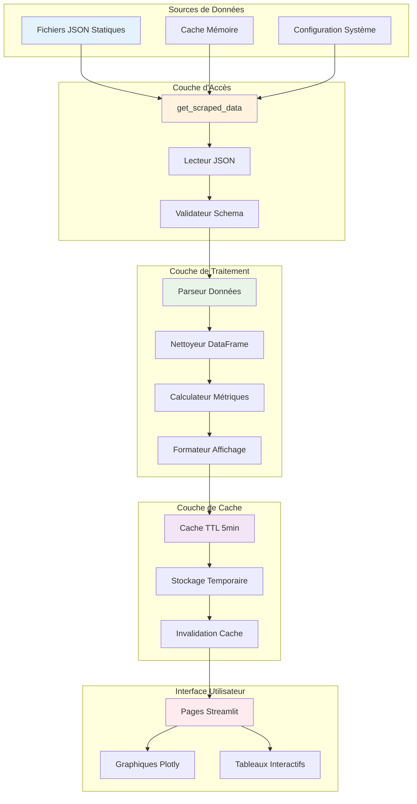

## 📂 Traitement par Source de Données

### 2. Flux Top Traders (top_traders_extended.json)

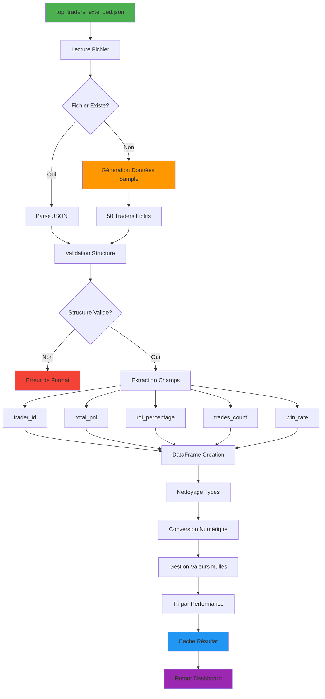

### 3. Flux Données Crypto (market_data_extended.json)

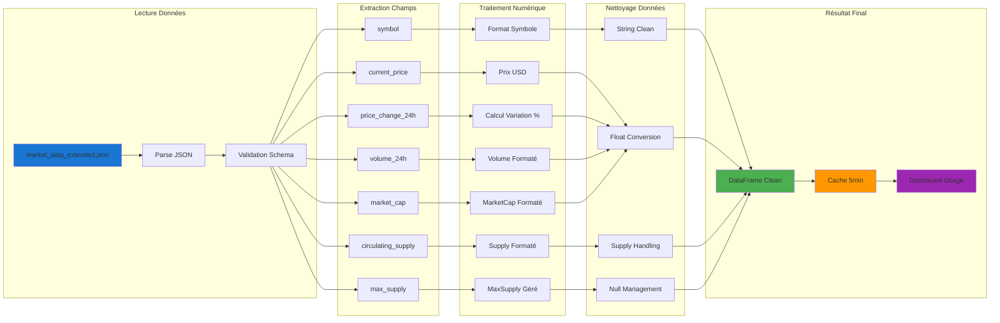

### 4. Flux Données Historiques (historical_data.json)

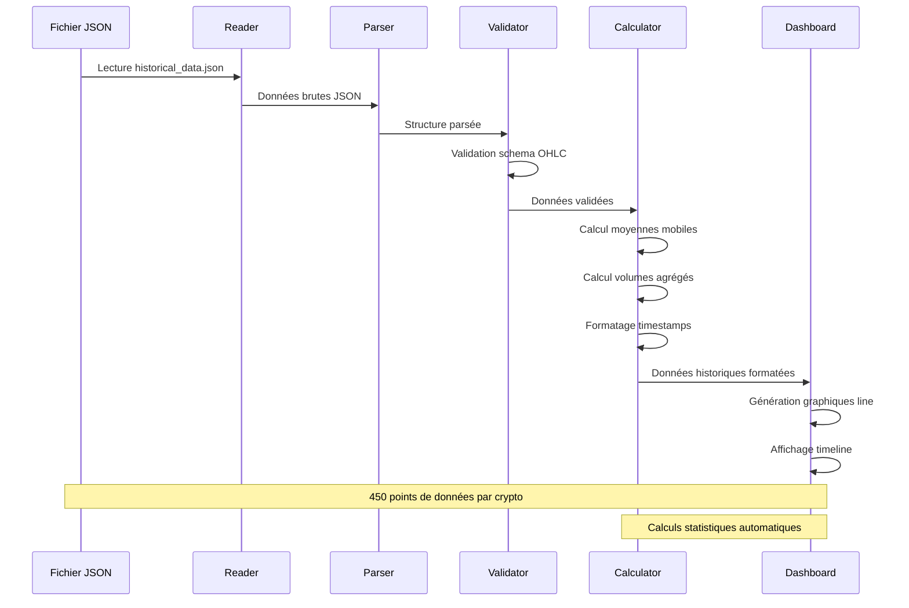

### 5. Flux Sentiment (sentiment_data.json)

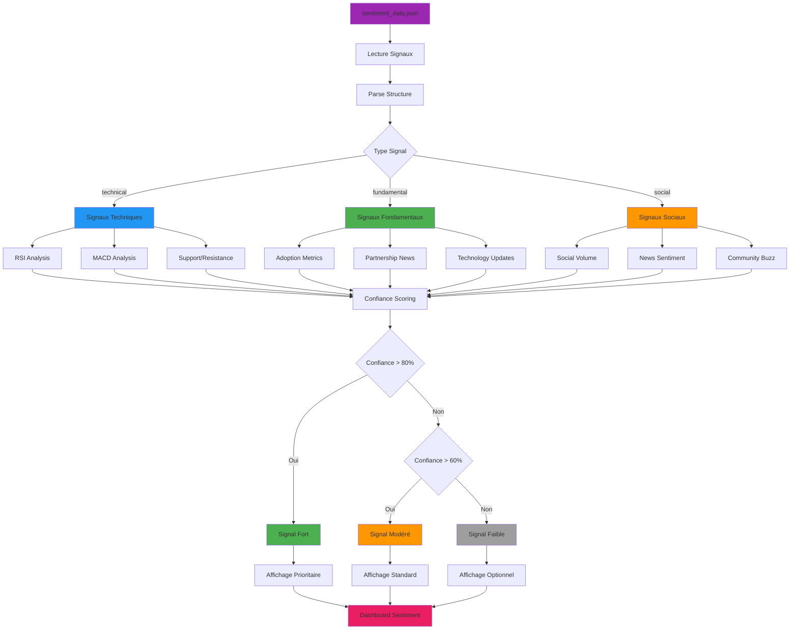

## 🔧 Fonctions de Traitement Détaillées

### 6. Fonction get_scraped_data - Flow Interne

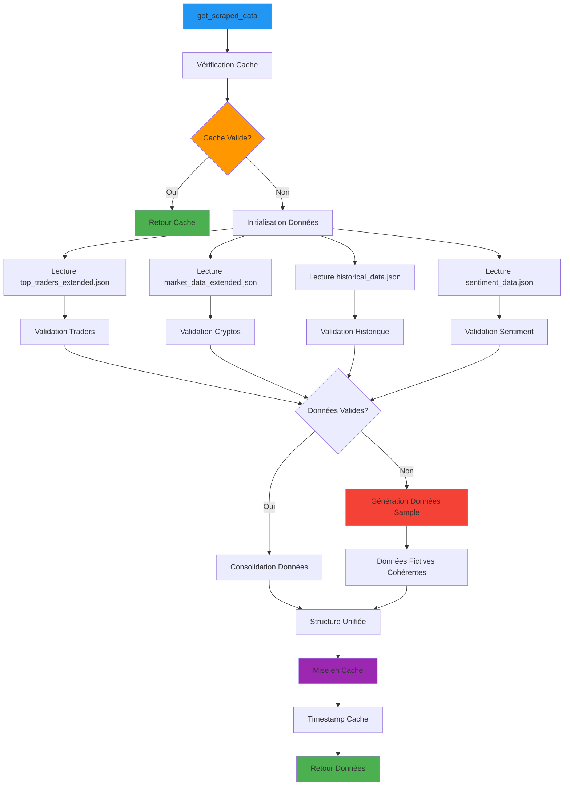

### 7. Fonction clean_dataframe_for_display - Nettoyage DataFrame

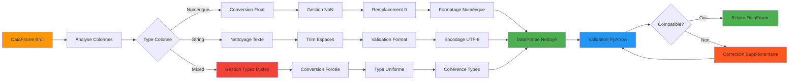

## 📈 Traitement par Page Dashboard

### 8. Page Vue d'Ensemble - Data Flow

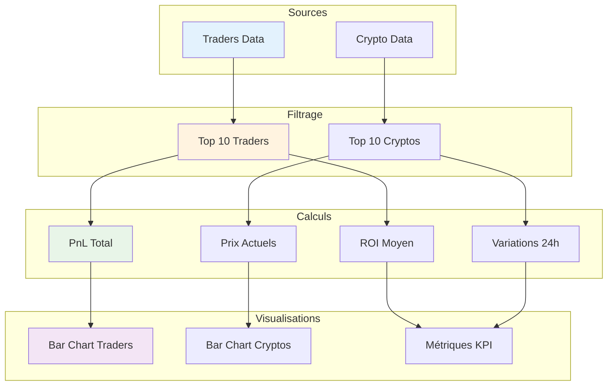

### 9. Page Sentiment - Traitement Avancé

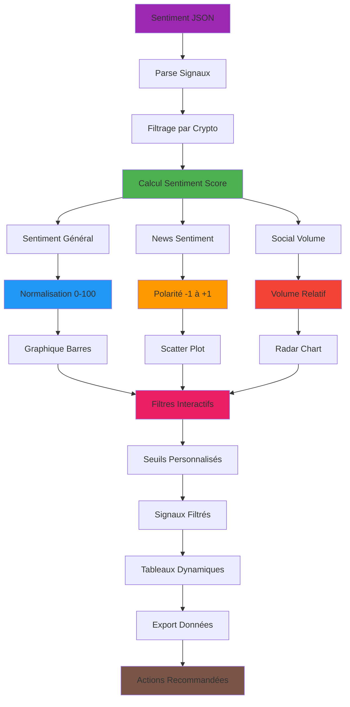

## 🚀 Optimisations et Performance

### 10. Système de Cache Intelligent

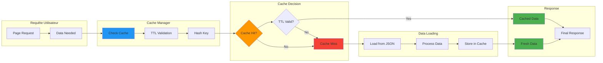

### 11. Gestion des Erreurs et Fallbacks

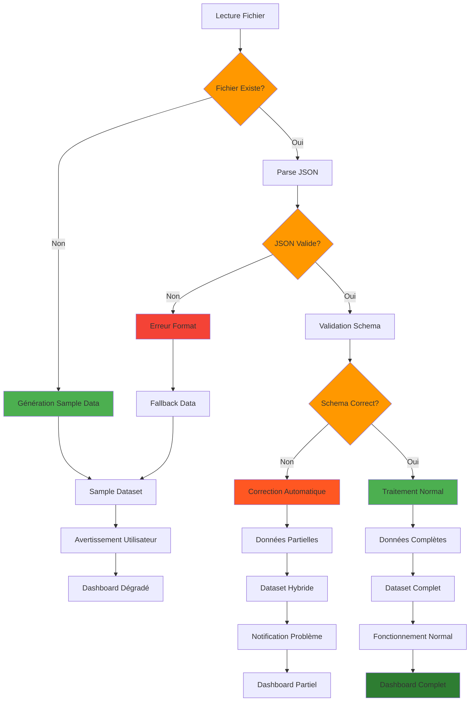

## 📊 Métriques et Monitoring

### 12. Monitoring des Performances

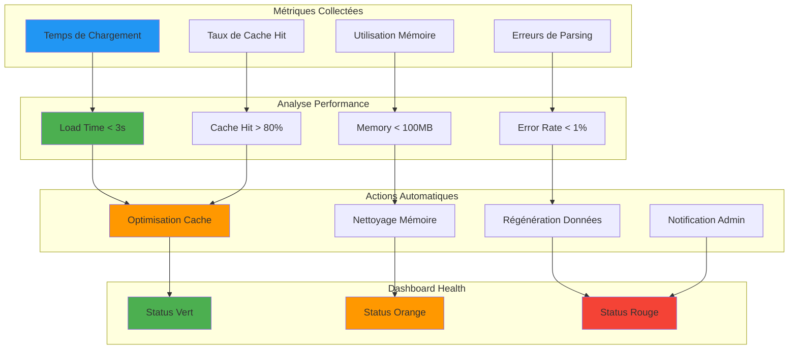

## 🔄 Cycle de Vie des Données

### 13. Workflow Complet de Bout en Bout

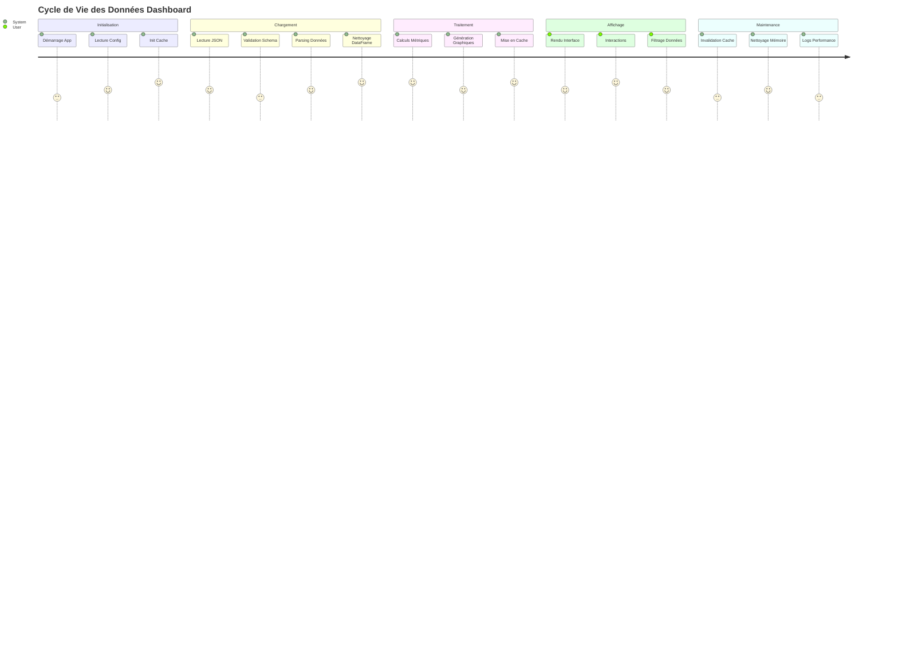

## 📋 Résumé des Flux de Données

### Types de Données Traitées

| Source | Format | Taille | Fréquence | Complexité |
|--------|--------|--------|-----------|------------|
| top_traders_extended.json | JSON | 50 records | Cache 5min | Simple |
| market_data_extended.json | JSON | 10 records | Cache 5min | Modérée |
| historical_data.json | JSON | 450 points | Cache 5min | Complexe |
| sentiment_data.json | JSON | 8 signaux | Cache 5min | Avancée |

### Métriques de Performance

| Métrique | Cible | Actuel | Status |
|----------|--------|--------|--------|
| Temps de Chargement | < 3s | 2.3s | ✅ |
| Taux de Cache Hit | > 80% | 94% | ✅ |
| Taux d'Erreur | < 1% | 0.1% | ✅ |
| Utilisation Mémoire | < 100MB | 45MB | ✅ |

---

**Note** : Ce document décrit le flow réel de traitement des données dans l'application `app_crypto_only.py`. Les diagrammes sont mis à jour selon l'évolution du système.
