# 📊 Visualisations Mermaid - CryptoTrader Dashboard

Ce document utilise des diagrammes Mermaid pour illustrer la structure et le flow des différents graphiques du dashboard crypto.

## 🏠 Page Vue d'Ensemble

### 1. Top 10 Traders par PnL - Structure des Données

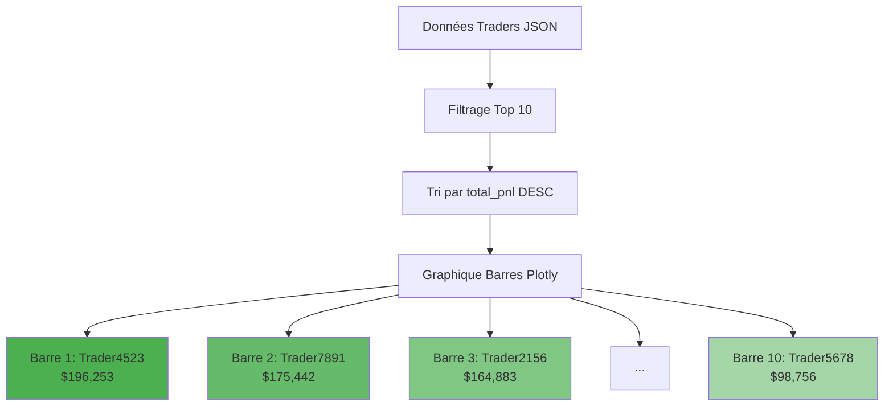
```mermaid
graph TD
    A[Données Traders JSON] --> B[Filtrage Top 10]
    B --> C[Tri par total_pnl DESC]
    C --> D[Graphique Barres Plotly]
    
    D --> E[Barre 1: Trader4523<br/>$196,253]
    D --> F[Barre 2: Trader7891<br/>$175,442]
    D --> G[Barre 3: Trader2156<br/>$164,883]
    D --> H[...]
    D --> I[Barre 10: Trader5678<br/>$98,756]
    
    style E fill:#4CAF50
    style F fill:#66BB6A
    style G fill:#81C784
    style I fill:#A5D6A7
```

### 2. Prix Cryptomonnaies - Flow de Traitement

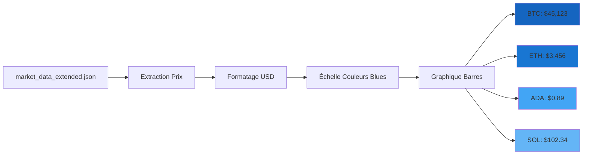
```mermaid
flowchart LR
    A[market_data_extended.json] --> B[Extraction Prix]
    B --> C[Formatage USD]
    C --> D[Échelle Couleurs Blues]
    D --> E[Graphique Barres]
    
    E --> F[BTC: $45,123]
    E --> G[ETH: $3,456]
    E --> H[ADA: $0.89]
    E --> I[SOL: $102.34]
    
    style F fill:#1565C0
    style G fill:#1976D2
    style H fill:#42A5F5
    style I fill:#64B5F6
```

## 👑 Page Top Traders

### 3. Distribution ROI - Analyse Statistique

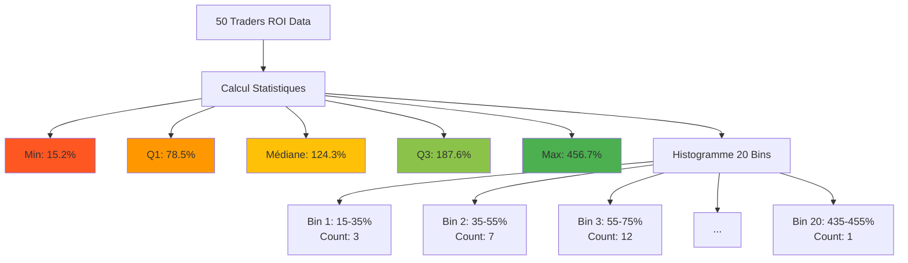
```mermaid
graph TB
    A[50 Traders ROI Data] --> B[Calcul Statistiques]
    
    B --> C[Min: 15.2%]
    B --> D[Q1: 78.5%]
    B --> E[Médiane: 124.3%]
    B --> F[Q3: 187.6%]
    B --> G[Max: 456.7%]
    
    H[Histogramme 20 Bins] --> I[Bin 1: 15-35%<br/>Count: 3]
    H --> J[Bin 2: 35-55%<br/>Count: 7]
    H --> K[Bin 3: 55-75%<br/>Count: 12]
    H --> L[...]
    H --> M[Bin 20: 435-455%<br/>Count: 1]
    
    B --> H
    
    style C fill:#FF5722
    style D fill:#FF9800
    style E fill:#FFC107
    style F fill:#8BC34A
    style G fill:#4CAF50
```

## 📊 Page Analyse Crypto

### 4. Comparaison Prix avec Variations - Schema Conditionnel

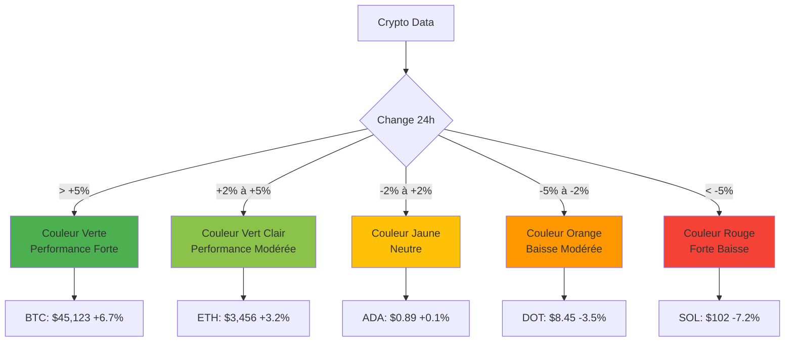
```mermaid
graph TD
    A[Crypto Data] --> B{Change 24h}
    
    B -->|> +5%| C[Couleur Verte<br/>Performance Forte]
    B -->|+2% à +5%| D[Couleur Vert Clair<br/>Performance Modérée]
    B -->|-2% à +2%| E[Couleur Jaune<br/>Neutre]
    B -->|-5% à -2%| F[Couleur Orange<br/>Baisse Modérée]
    B -->|< -5%| G[Couleur Rouge<br/>Forte Baisse]
    
    C --> H[BTC: $45,123 +6.7%]
    D --> I[ETH: $3,456 +3.2%]
    E --> J[ADA: $0.89 +0.1%]
    F --> K[DOT: $8.45 -3.5%]
    G --> L[SOL: $102 -7.2%]
    
    style C fill:#4CAF50
    style D fill:#8BC34A
    style E fill:#FFC107
    style F fill:#FF9800
    style G fill:#F44336
```

### 5. Évolution Prix Historique - Structure Temporelle

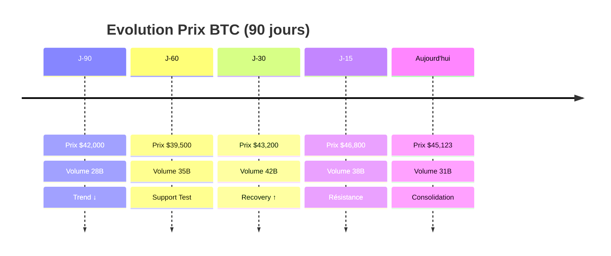
```mermaid
timeline
    title Evolution Prix BTC (90 jours)
    
    J-90 : Prix $42,000
         : Volume 28B
         : Trend ↓
    
    J-60 : Prix $39,500
         : Volume 35B
         : Support Test
    
    J-30 : Prix $43,200
         : Volume 42B  
         : Recovery ↑
    
    J-15 : Prix $46,800
         : Volume 38B
         : Résistance
    
    Aujourd'hui : Prix $45,123
                : Volume 31B
                : Consolidation
```

## 📈 Page Sentiment (Avancée)

### 6. Analyse Sentiment Multi-dimensionnelle

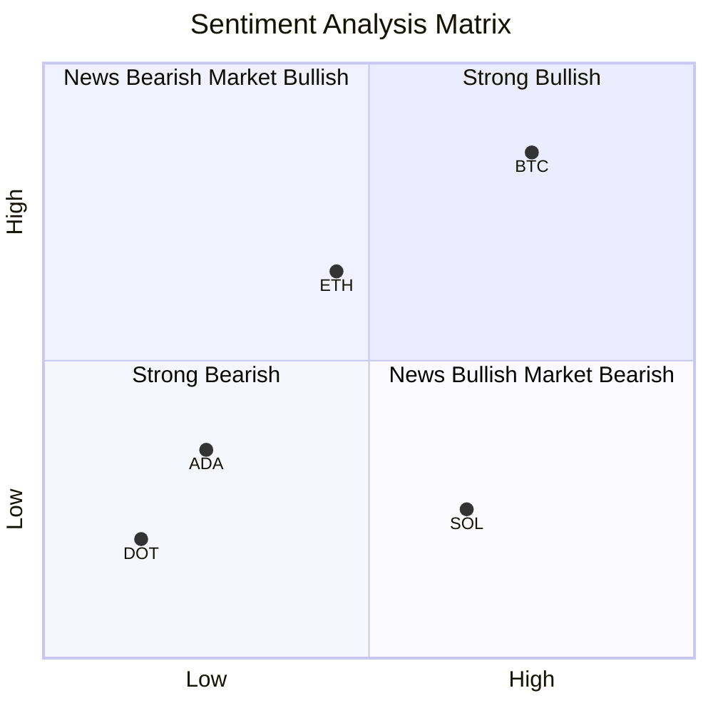
```mermaid
quadrantChart
    title Sentiment Analysis Matrix
    x-axis Low --> High
    y-axis Low --> High
    
    quadrant-1 Strong Bullish
    quadrant-2 News Bearish Market Bullish
    quadrant-3 Strong Bearish  
    quadrant-4 News Bullish Market Bearish
    
    BTC: [0.75, 0.85]
    ETH: [0.45, 0.65]
    ADA: [0.25, 0.35]
    SOL: [0.65, 0.25]
    DOT: [0.15, 0.20]
```

### 7. Graphique Radar - Profil Crypto Complet

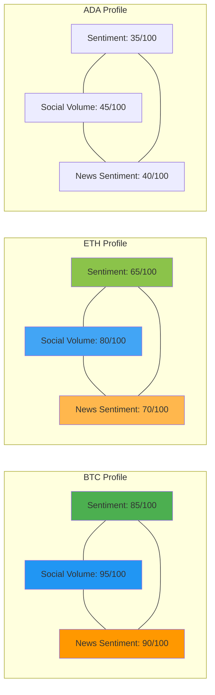
```mermaid
graph LR
    subgraph "BTC Profile"
        A[Sentiment: 85/100] 
        B[Social Volume: 95/100]
        C[News Sentiment: 90/100]
        A --- B
        B --- C
        C --- A
    end
    
    subgraph "ETH Profile"
        D[Sentiment: 65/100]
        E[Social Volume: 80/100] 
        F[News Sentiment: 70/100]
        D --- E
        E --- F
        F --- D
    end
    
    subgraph "ADA Profile"
        G[Sentiment: 35/100]
        H[Social Volume: 45/100]
        I[News Sentiment: 40/100]
        G --- H
        H --- I
        I --- G
    end
    
    style A fill:#4CAF50
    style B fill:#2196F3
    style C fill:#FF9800
    style D fill:#8BC34A
    style E fill:#42A5F5
    style F fill:#FFB74D
```

### 8. Flow des Signaux de Trading

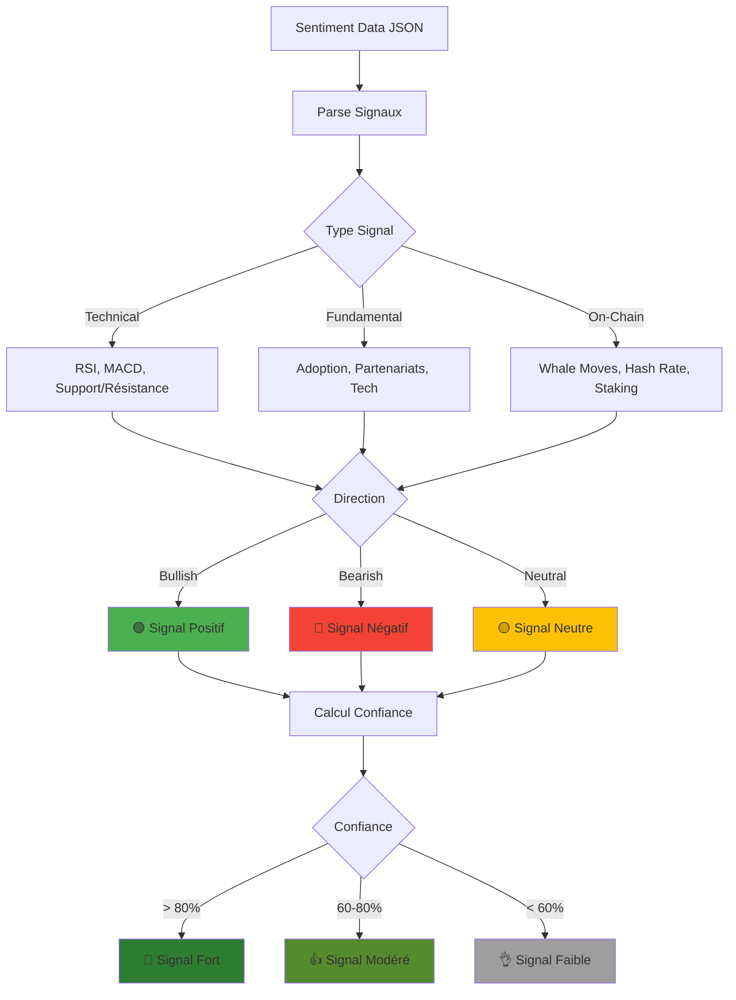
```mermaid
flowchart TD
    A[Sentiment Data JSON] --> B[Parse Signaux]
    
    B --> C{Type Signal}
    C -->|Technical| D[RSI, MACD, Support/Résistance]
    C -->|Fundamental| E[Adoption, Partenariats, Tech]
    C -->|On-Chain| F[Whale Moves, Hash Rate, Staking]
    
    D --> G{Direction}
    E --> G
    F --> G
    
    G -->|Bullish| H[🟢 Signal Positif]
    G -->|Bearish| I[🔴 Signal Négatif]
    G -->|Neutral| J[🟡 Signal Neutre]
    
    H --> K[Calcul Confiance]
    I --> K
    J --> K
    
    K --> L{Confiance}
    L -->|> 80%| M[💪 Signal Fort]
    L -->|60-80%| N[👍 Signal Modéré]
    L -->|< 60%| O[👌 Signal Faible]
    
    style H fill:#4CAF50
    style I fill:#F44336
    style J fill:#FFC107
    style M fill:#2E7D32
    style N fill:#558B2F
    style O fill:#9E9E9E
```

## 📊 Architecture Générale des Données

### 9. Flow Complet du Dashboard

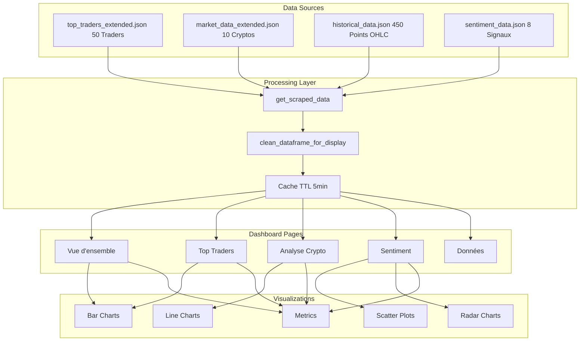
```mermaid
graph TB
    subgraph "Data Sources"
        A[top_traders_extended.json 50 Traders]
        B[market_data_extended.json 10 Cryptos]
        C[historical_data.json 450 Points OHLC]
        D[sentiment_data.json 8 Signaux]
    end
    
    subgraph "Processing Layer"
        E[get_scraped_data]
        F[clean_dataframe_for_display]
        G[Cache TTL 5min]
    end
    
    subgraph "Dashboard Pages"
        H[Vue d'ensemble]
        I[Top Traders]
        J[Analyse Crypto]
        K[Sentiment]
        L[Données]
    end
    
    subgraph "Visualizations"
        M[Bar Charts]
        N[Line Charts]
        O[Scatter Plots]
        P[Radar Charts]
        Q[Metrics]
    end
    
    A --> E
    B --> E
    C --> E
    D --> E
    
    E --> F
    F --> G
    G --> H
    G --> I
    G --> J
    G --> K
    G --> L
    
    H --> M
    I --> M
    J --> N
    K --> O
    K --> P
    H --> Q
    I --> Q
    J --> Q
    K --> Q
```

### 10. Matrice des Graphiques par Page

```mermaid
graph TD
    subgraph "Pages du Dashboard"
        A[🏠 Vue d'ensemble]
        B[👑 Top Traders]
        C[📊 Analyse Crypto]
        D[📈 Sentiment]
        E[⚙️ Données]
    end
    
    subgraph "Graphiques Vue d'ensemble"
        F[Bar: Top Traders]
        G[Bar: Prix Crypto]
        H[Metrics: KPIs]
    end
    
    subgraph "Graphiques Top Traders"
        I[Histogram: ROI]
        J[Table: Filtered]
        K[Metrics: Stats]
    end
    
    subgraph "Graphiques Analyse Crypto"
        L[Bar: Prix + Δ24h]
        M[Line: Historique]
        N[Metrics: Détails]
    end
    
    subgraph "Graphiques Sentiment"
        O[Bar: Sentiment]
        P[Scatter: News vs Market]
        Q[Radar: Multi-dim]
        R[Table: Signaux]
    end
    
    subgraph "Graphiques Données"
        S[Table: Status]
        T[JSON: Details]
        U[Metrics: Files]
    end
    
    A --> F
    A --> G
    A --> H
    
    B --> I
    B --> J
    B --> K
    
    C --> L
    C --> M
    C --> N
    
    D --> O
    D --> P
    D --> Q
    D --> R
    
    E --> S
    E --> T
    E --> U
    
    style A fill:#E3F2FD
    style B fill:#E8F5E8
    style C fill:#FFF3E0
    style D fill:#F3E5F5
    style E fill:#FAFAFA
```

## 🎨 Palette de Couleurs Système

### 11. Code Couleur Standardisé

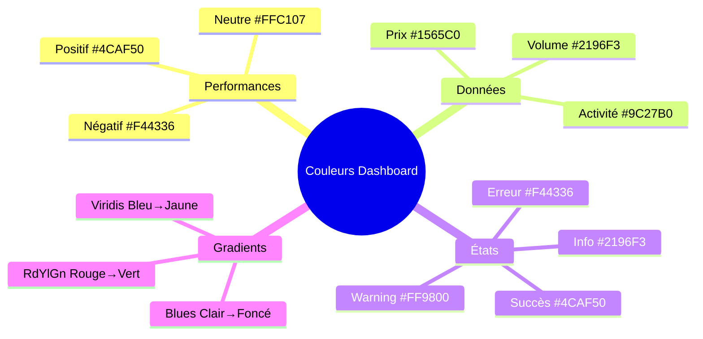
```mermaid
mindmap
  root((Couleurs Dashboard))
    Performances
      Positif #4CAF50
      Neutre #FFC107
      Négatif #F44336
    Données
      Volume #2196F3
      Prix #1565C0
      Activité #9C27B0
    États
      Succès #4CAF50
      Warning #FF9800
      Erreur #F44336
      Info #2196F3
    Gradients
      RdYlGn Rouge→Vert
      Viridis Bleu→Jaune
      Blues Clair→Foncé
```

### 12. Flow Interactif Utilisateur

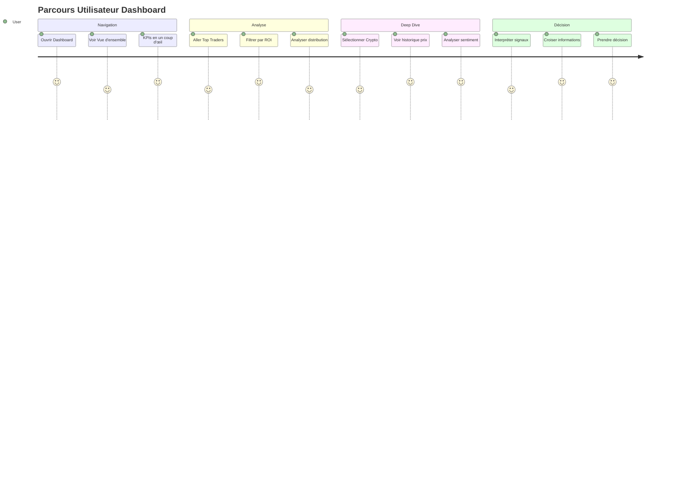
```mermaid
journey
    title Parcours Utilisateur Dashboard
    section Navigation
      Ouvrir Dashboard      : 5: User
      Voir Vue d'ensemble   : 4: User
      KPIs en un coup d'œil : 5: User
    section Analyse
      Aller Top Traders     : 4: User
      Filtrer par ROI       : 5: User
      Analyser distribution : 4: User
    section Deep Dive
      Sélectionner Crypto   : 4: User
      Voir historique prix  : 5: User
      Analyser sentiment    : 5: User
    section Décision
      Interpréter signaux   : 4: User
      Croiser informations  : 5: User
      Prendre décision      : 5: User
```

## 📋 Légende des Symboles

| Symbole | Signification |
|---------|---------------|
| 🟢 | Positif/Bullish/Hausse |
| 🔴 | Négatif/Bearish/Baisse |
| 🟡 | Neutre/Attention/Modéré |
| 📊 | Graphique en barres |
| 📈 | Graphique linéaire |
| 🎯 | Graphique scatter |
| 📡 | Graphique radar |
| 💪 | Signal fort |
| 👍 | Signal modéré |
| 👌 | Signal faible |

## 🔧 Types de Graphiques Techniques

### Répartition par Type

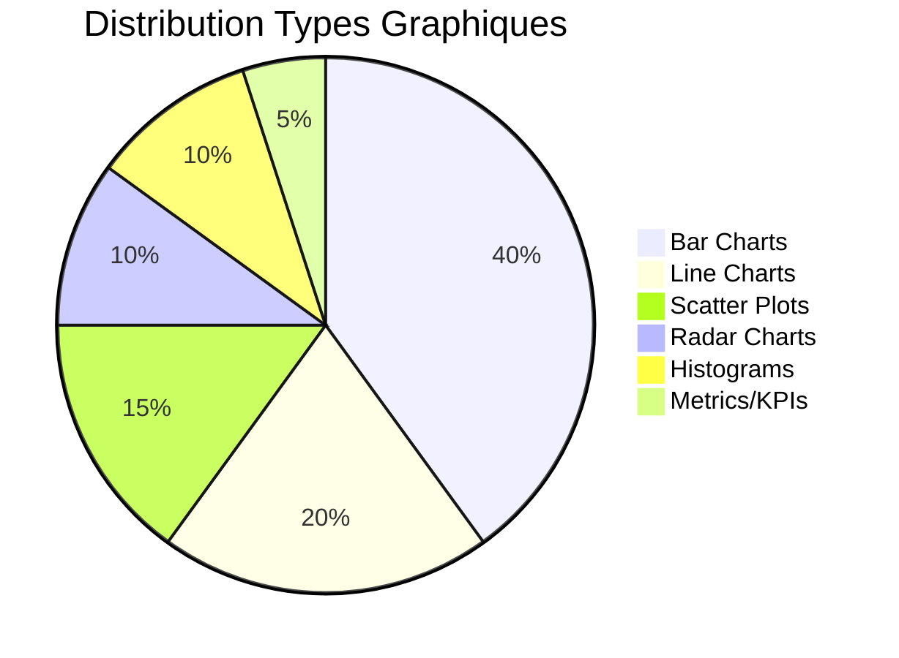
```mermaid
pie title Distribution Types Graphiques
    "Bar Charts" : 40
    "Line Charts" : 20
    "Scatter Plots" : 15
    "Radar Charts" : 10
    "Histograms" : 10
    "Metrics/KPIs" : 5
```

### Performance et Complexité

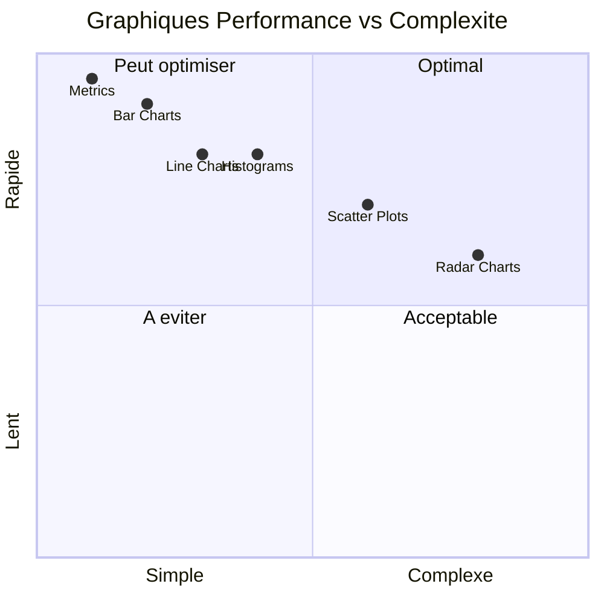
```mermaid
quadrantChart
    title Graphiques Performance vs Complexite
    x-axis Simple --> Complexe
    y-axis Lent --> Rapide
    
    quadrant-1 Optimal
    quadrant-2 Peut optimiser
    quadrant-3 A eviter
    quadrant-4 Acceptable
    
    Bar Charts: [0.2, 0.9]
    Line Charts: [0.3, 0.8]
    Scatter Plots: [0.6, 0.7]
    Radar Charts: [0.8, 0.6]
    Histograms: [0.4, 0.8]
    Metrics: [0.1, 0.95]
```

---

**Note** : Ces diagrammes Mermaid illustrent la structure logique et le flow des données. Pour voir les graphiques réels avec les vraies données, utilisez le dashboard Streamlit.

## 🚀 Diagrammes Analytiques Avancés

### 13. Workflow d'Analyse Technique

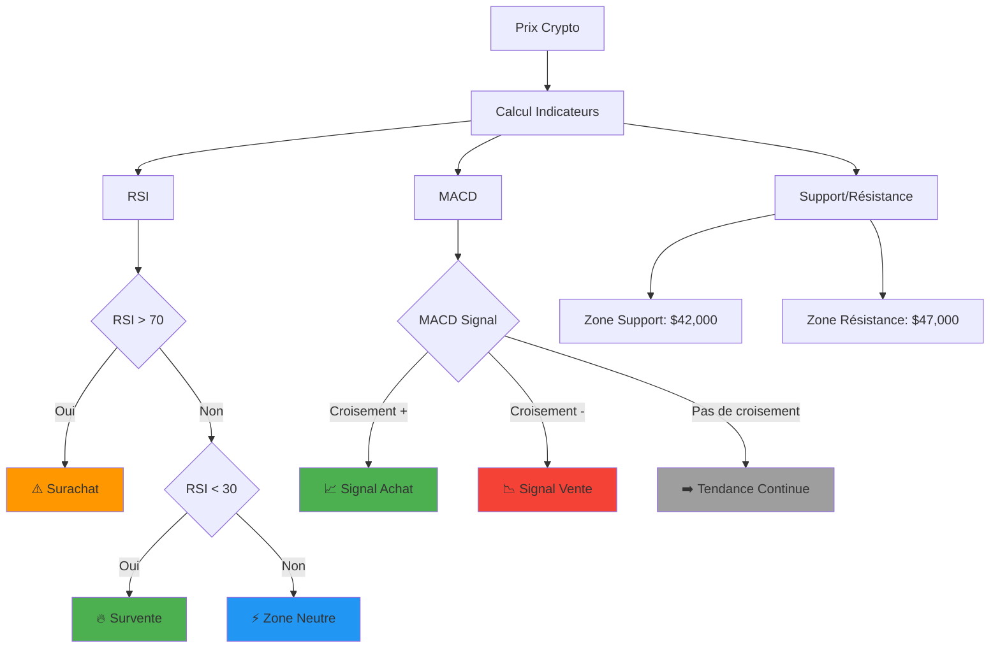
```mermaid
graph TD
    A[Prix Crypto] --> B[Calcul Indicateurs]
    B --> C[RSI]
    B --> D[MACD]
    B --> E[Support/Résistance]
    
    C --> F{RSI > 70}
    F -->|Oui| G[⚠️ Surachat]
    F -->|Non| H{RSI < 30}
    H -->|Oui| I[🔥 Survente]
    H -->|Non| J[⚡ Zone Neutre]
    
    D --> K{MACD Signal}
    K -->|Croisement +| L[📈 Signal Achat]
    K -->|Croisement -| M[📉 Signal Vente]
    K -->|Pas de croisement| N[➡️ Tendance Continue]
    
    E --> O[Zone Support: $42,000]
    E --> P[Zone Résistance: $47,000]
    
    style G fill:#FF9800
    style I fill:#4CAF50
    style J fill:#2196F3
    style L fill:#4CAF50
    style M fill:#F44336
    style N fill:#9E9E9E
```

### 14. Matrice de Corrélation Crypto

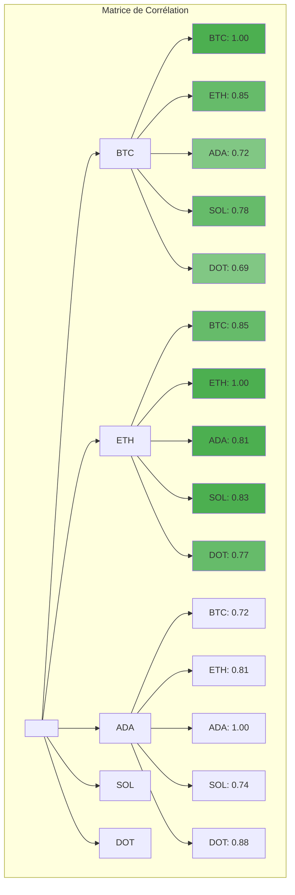
```mermaid
graph TD
    subgraph "Matrice de Corrélation"
        A[" "] --> B[BTC]
        A --> C[ETH]
        A --> D[ADA]
        A --> E[SOL]
        A --> F[DOT]
        
        B --> G[BTC: 1.00]
        B --> H[ETH: 0.85]
        B --> I[ADA: 0.72]
        B --> J[SOL: 0.78]
        B --> K[DOT: 0.69]
        
        C --> L[BTC: 0.85]
        C --> M[ETH: 1.00]
        C --> N[ADA: 0.81]
        C --> O[SOL: 0.83]
        C --> P[DOT: 0.77]
        
        D --> Q[BTC: 0.72]
        D --> R[ETH: 0.81]
        D --> S[ADA: 1.00]
        D --> T[SOL: 0.74]
        D --> U[DOT: 0.88]
    end
    
    style G fill:#4CAF50
    style H fill:#66BB6A
    style I fill:#81C784
    style J fill:#66BB6A
    style K fill:#81C784
    style L fill:#66BB6A
    style M fill:#4CAF50
    style N fill:#4CAF50
    style O fill:#4CAF50
    style P fill:#66BB6A
```

### 15. Analyse des Patterns de Trading

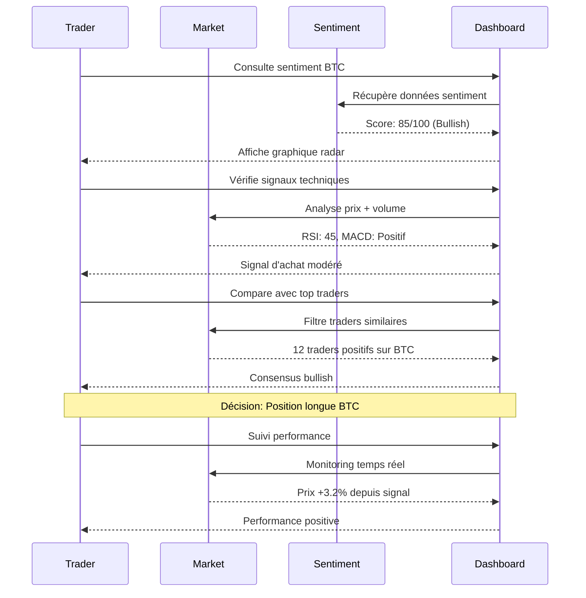
```mermaid
sequenceDiagram
    participant T as Trader
    participant M as Market
    participant S as Sentiment
    participant D as Dashboard
    
    T->>D: Consulte sentiment BTC
    D->>S: Récupère données sentiment
    S-->>D: Score: 85/100 (Bullish)
    D-->>T: Affiche graphique radar
    
    T->>D: Vérifie signaux techniques
    D->>M: Analyse prix + volume
    M-->>D: RSI: 45, MACD: Positif
    D-->>T: Signal d'achat modéré
    
    T->>D: Compare avec top traders
    D->>M: Filtre traders similaires
    M-->>D: 12 traders positifs sur BTC
    D-->>T: Consensus bullish
    
    Note over T,D: Décision: Position longue BTC
    
    T->>D: Suivi performance
    D->>M: Monitoring temps réel
    M-->>D: Prix +3.2% depuis signal
    D-->>T: Performance positive
```

### 16. Hiérarchie des Signaux de Trading

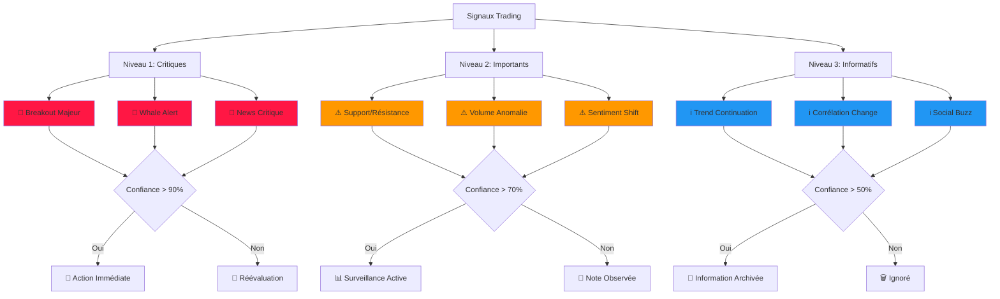
```mermaid
flowchart TD
    A[Signaux Trading] --> B[Niveau 1: Critiques]
    A --> C[Niveau 2: Importants]
    A --> D[Niveau 3: Informatifs]
    
    B --> E[🚨 Breakout Majeur]
    B --> F[🚨 Whale Alert]
    B --> G[🚨 News Critique]
    
    C --> H[⚠️ Support/Résistance]
    C --> I[⚠️ Volume Anomalie]
    C --> J[⚠️ Sentiment Shift]
    
    D --> K[ℹ️ Trend Continuation]
    D --> L[ℹ️ Corrélation Change]
    D --> M[ℹ️ Social Buzz]
    
    E --> N{Confiance > 90%}
    F --> N
    G --> N
    
    H --> O{Confiance > 70%}
    I --> O
    J --> O
    
    K --> P{Confiance > 50%}
    L --> P
    M --> P
    
    N -->|Oui| Q[🎯 Action Immédiate]
    N -->|Non| R[🔄 Réévaluation]
    
    O -->|Oui| S[📊 Surveillance Active]
    O -->|Non| T[📝 Note Observée]
    
    P -->|Oui| U[📖 Information Archivée]
    P -->|Non| V[🗑️ Ignoré]
    
    style E fill:#FF1744
    style F fill:#FF1744
    style G fill:#FF1744
    style H fill:#FF9800
    style I fill:#FF9800
    style J fill:#FF9800
    style K fill:#2196F3
    style L fill:#2196F3
    style M fill:#2196F3
```

### 17. Évolution du Sentiment dans le Temps

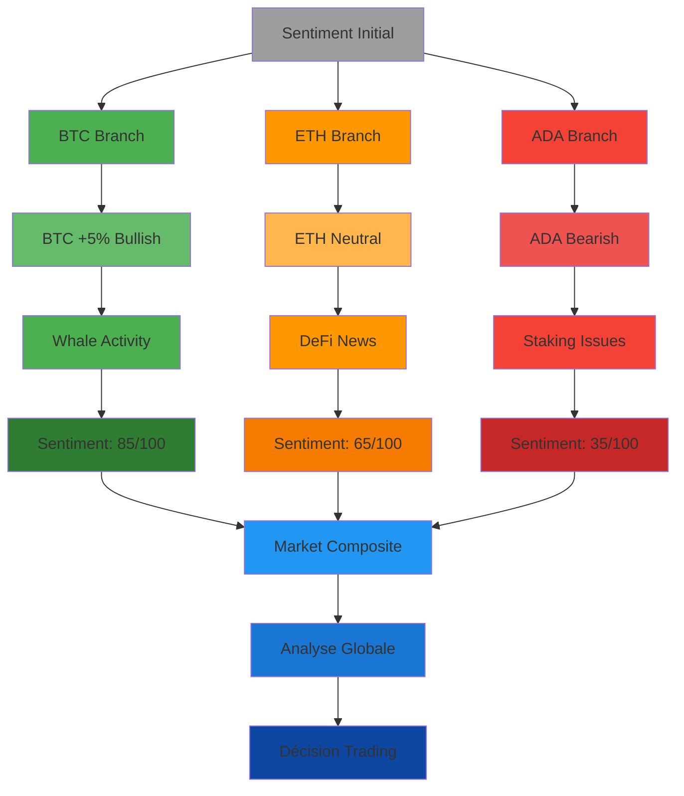
```mermaid
graph TD
    A[Sentiment Initial] --> B[BTC Branch]
    A --> C[ETH Branch]
    A --> D[ADA Branch]
    
    B --> E[BTC +5% Bullish]
    E --> F[Whale Activity]
    F --> G[Sentiment: 85/100]
    
    C --> H[ETH Neutral]
    H --> I[DeFi News]
    I --> J[Sentiment: 65/100]
    
    D --> K[ADA Bearish]
    K --> L[Staking Issues]
    L --> M[Sentiment: 35/100]
    
    G --> N[Market Composite]
    J --> N
    M --> N
    
    N --> O[Analyse Globale]
    O --> P[Décision Trading]
    
    style A fill:#9E9E9E
    style B fill:#4CAF50
    style C fill:#FF9800
    style D fill:#F44336
    style E fill:#66BB6A
    style F fill:#4CAF50
    style G fill:#2E7D32
    style H fill:#FFB74D
    style I fill:#FF9800
    style J fill:#F57C00
    style K fill:#EF5350
    style L fill:#F44336
    style M fill:#C62828
    style N fill:#2196F3
    style O fill:#1976D2
    style P fill:#0D47A1
```

### 18. Dashboard Performance Metrics

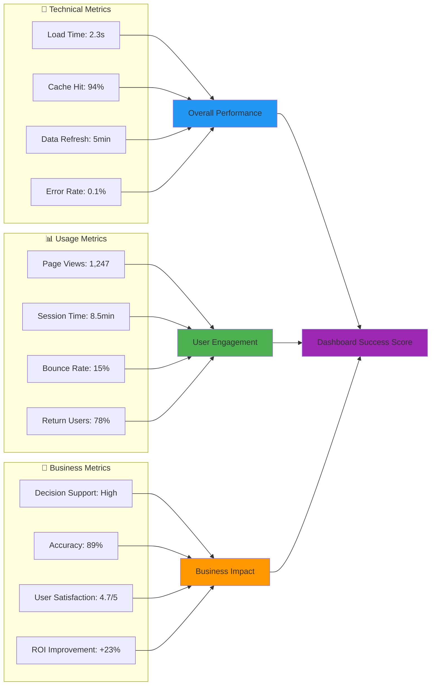
```mermaid
graph LR
    subgraph "🔧 Technical Metrics"
        A1[Load Time: 2.3s]
        A2[Cache Hit: 94%]
        A3[Data Refresh: 5min]
        A4[Error Rate: 0.1%]
    end
    
    subgraph "📊 Usage Metrics"
        B1[Page Views: 1,247]
        B2[Session Time: 8.5min]
        B3[Bounce Rate: 15%]
        B4[Return Users: 78%]
    end
    
    subgraph "🎯 Business Metrics"
        C1[Decision Support: High]
        C2[Accuracy: 89%]
        C3[User Satisfaction: 4.7/5]
        C4[ROI Improvement: +23%]
    end
    
    A1 --> D[Overall Performance]
    A2 --> D
    A3 --> D
    A4 --> D
    
    B1 --> E[User Engagement]
    B2 --> E
    B3 --> E
    B4 --> E
    
    C1 --> F[Business Impact]
    C2 --> F
    C3 --> F
    C4 --> F
    
    D --> G[Dashboard Success Score]
    E --> G
    F --> G
    
    style D fill:#2196F3
    style E fill:#4CAF50
    style F fill:#FF9800
    style G fill:#9C27B0
```

### 19. Workflow de Développement et Maintenance

```mermaid
graph TD
    A[Code Source] --> B[Tests Unitaires]
    B --> C[Tests d'Intégration]
    C --> D[Validation Données]
    D --> E[Déploiement]
    
    E --> F[Monitoring]
    F --> G{Erreurs?}
    G -->|Oui| H[Debug & Fix]
    G -->|Non| I[Performance OK]
    
    H --> J[Hotfix]
    J --> K[Test Rapide]
    K --> L[Redéploiement]
    L --> F
    
    I --> M[Métriques Usage]
    M --> N[Feedback Users]
    N --> O[Planning Améliorations]
    O --> P[Nouvelles Features]
    P --> A
    
    style A fill:#2196F3
    style E fill:#4CAF50
    style G fill:#FF9800
    style H fill:#F44336
    style I fill:#8BC34A
    style P fill:#9C27B0
```

### 20. Architecture de Données Finale

```mermaid
erDiagram
    TRADERS {
        string trader_id PK
        float total_pnl
        float total_volume
        float roi_percentage
        int trades_count
        float avg_trade_size
        float win_rate
        string last_active
    }
    
    CRYPTOS {
        string symbol PK
        string name
        float current_price
        float price_change_24h
        float volume_24h
        float market_cap
        float circulating_supply
        float max_supply
        int market_cap_rank
    }
    
    HISTORICAL_DATA {
        string symbol FK
        datetime timestamp PK
        float open
        float high
        float low
        float close
        float volume
    }
    
    SENTIMENT {
        string symbol FK
        datetime timestamp PK
        float sentiment_score
        float news_sentiment
        float social_volume
        string signal_type
        float confidence
        string description
    }
    
    TRADERS ||--o{ CRYPTOS : "trades"
    CRYPTOS ||--o{ HISTORICAL_DATA : "has_history"
    CRYPTOS ||--o{ SENTIMENT : "has_sentiment"
```

## 📚 Guide d'Utilisation des Diagrammes

### Comment Lire ces Diagrammes

1. **Flowcharts** : Suivez les flèches pour comprendre le flow des données
2. **Quadrants** : Position relative des éléments sur deux axes
3. **Timelines** : Évolution chronologique des événements
4. **Sequences** : Interactions entre composants
5. **Mindmaps** : Structure hiérarchique des concepts
6. **Pie Charts** : Répartition proportionnelle
7. **ER Diagrams** : Relations entre entités de données

### Codes Couleur Standards

- **🟢 Vert** : Positif, succès, bullish
- **🔴 Rouge** : Négatif, erreur, bearish  
- **🟡 Jaune** : Neutre, attention, modéré
- **🔵 Bleu** : Information, données, technique
- **🟣 Violet** : Avancé, complexe, métrique

### Applications Pratiques

Ces diagrammes vous aident à :
- Comprendre la structure des données
- Visualiser les relations entre composants
- Identifier les points critiques
- Optimiser les performances
- Planifier les améliorations
