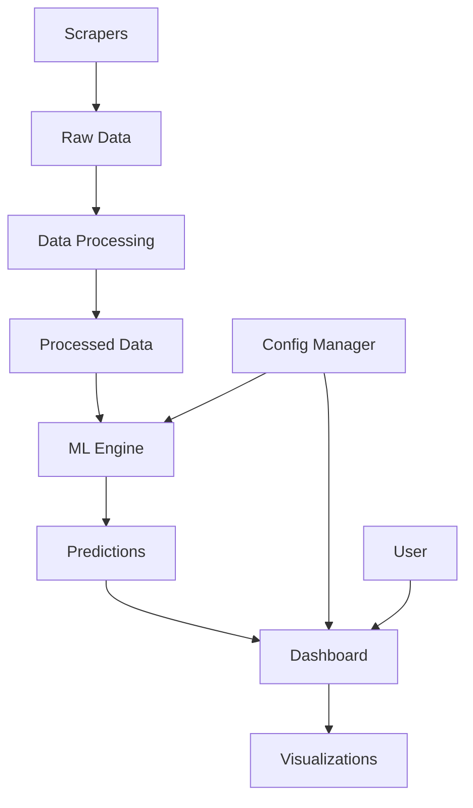

# 🏗️ ARCHITECTURE CRYPTO-TRACKER

## 📁 Structure du Projet

```
Crypto-Tracker/
├── 📁 PRODUCTION/           # Code de production stable
│   ├── 📁 api/             # API REST et endpoints
│   ├── 📁 core/            # Logique métier centrale
│   │   ├── config_manager.py
│   │   └── prediction_engine.py
│   ├── 📁 dashboard/       # Interface utilisateur Streamlit
│   │   ├── crypto_dashboard.py
│   │   └── 📁 components/
│   │       └── prediction_panel.py
│   └── 📁 models/          # Modèles ML sauvegardés
│
├── 📁 DEVELOPMENT/         # Développement et tests
│   ├── 📁 scrapers/        # Scripts de collecte de données
│   │   ├── 📁 core/        # Scrapers principaux
│   │   ├── 📁 api/         # API endpoints
│   │   └── 📁 ml/          # ML et prédictions
│   ├── 📁 prototypes/      # Prototypes et expérimentations
│   ├── 📁 ml_training/     # Entraînement des modèles
│   └── 📁 tests/           # Tests unitaires et d'intégration
│
├── 📁 RESOURCES/           # Ressources et données
│   ├── 📁 data/            # Données du projet
│   │   ├── 📁 processed/   # Données nettoyées et prêtes
│   │   ├── 📁 raw/         # Données brutes
│   │   └── 📁 exports/     # Exports et rapports
│   ├── 📁 configs/         # Fichiers de configuration
│   │   └── app_config.json
│   └── 📁 templates/       # Templates et modèles
│
├── 📁 ADMIN/               # Administration et infrastructure
│   ├── 📁 scripts/         # Scripts d'administration
│   │   ├── setup_environment.py
│   │   ├── run_application.py
│   │   └── cleanup_project.py
│   ├── 📁 config/          # Configuration système
│   │   └── 📁 docker/      # Configuration Docker
│   ├── 📁 deployment/      # Scripts de déploiement
│   └── 📁 logs/            # Logs système
│
├── 📁 DOCUMENTATION/       # Documentation complète
│   ├── 📁 guides/          # Guides utilisateur
│   │   └── user_guide.md
│   ├── 📁 technical/       # Documentation technique
│   │   └── ARCHITECTURE.md
│   └── 📁 api_docs/        # Documentation API
│
├── 📄 README.md            # Documentation principale
├── 📄 requirements.txt     # Dépendances Python
├── 📄 LICENSE              # Licence du projet
├── 📄 .gitignore           # Fichiers ignorés par Git
└── 📄 start_crypto_tracker.* # Scripts de démarrage
```

## 🎯 Principes d'Architecture

### 1. **Séparation des Responsabilités**
- **PRODUCTION** : Code stable et testé pour l'environnement de production
- **DEVELOPMENT** : Code en développement, tests et expérimentations
- **RESOURCES** : Données, configurations et ressources statiques
- **ADMIN** : Infrastructure, déploiement et maintenance
- **DOCUMENTATION** : Guides, documentation technique et API

### 2. **Modularité**
- Chaque module a une responsabilité unique et bien définie
- Couplage faible entre les modules
- Interfaces claires et documentées
- Réutilisabilité des composants

### 3. **Scalabilité**
- Structure évolutive pour de nouvelles fonctionnalités
- Séparation claire développement/production
- Architecture prête pour le déploiement
- Gestion centralisée de la configuration

### 4. **Maintenabilité**
- Code documenté selon les standards professionnels
- Nommage cohérent et conventions respectées
- Tests automatisés et validation continue
- Logs structurés et monitoring

## 🔧 Composants Principaux

### PRODUCTION/core/
- **config_manager.py** : Gestionnaire de configuration centralisé
- **prediction_engine.py** : Moteur ML Random Forest pour prédictions

### PRODUCTION/dashboard/
- **crypto_dashboard.py** : Interface Streamlit principale
- **components/prediction_panel.py** : Composant de prédiction modulaire

### RESOURCES/data/processed/
- **top_traders_for_prediction.json** : Données traders pour ML
- **top_traders_extended.json** : Données traders pour analyse
- **market_data_extended.json** : Données de marché crypto

### RESOURCES/configs/
- **app_config.json** : Configuration centralisée complète

## 🚀 Points d'Entrée

### Dashboard Principal
```bash
python start_crypto_tracker.py
# ou
streamlit run PRODUCTION/dashboard/crypto_dashboard.py
```

### Scripts d'Administration
```bash
python ADMIN/scripts/setup_environment.py
python ADMIN/scripts/run_application.py
```

### API REST (Future)
```bash
python PRODUCTION/api/main.py
```

## 📊 Flux de Données



1. **Collecte** : `DEVELOPMENT/scrapers/` → `RESOURCES/data/raw/`
2. **Traitement** : `PRODUCTION/core/` → `RESOURCES/data/processed/`
3. **Prédiction** : `PRODUCTION/core/prediction_engine.py`
4. **Configuration** : `PRODUCTION/core/config_manager.py`
5. **Affichage** : `PRODUCTION/dashboard/crypto_dashboard.py`

## 🎨 Standards de Développement

### Nommage
- **Classes** : PascalCase (`CryptoTraderPredictor`)
- **Fonctions** : snake_case (`predict_profitability`)
- **Constantes** : UPPER_SNAKE_CASE (`MAX_TRADERS`)
- **Fichiers** : snake_case (`prediction_engine.py`)

### Documentation
- **Docstrings** : Format OBJECTIF/PARAMÈTRES/RETOURNE/LOGIQUE
- **Commentaires** : Explications du "pourquoi", pas du "comment"
- **README** : Documentation utilisateur complète
- **Architecture** : Documentation technique détaillée

### Tests
- **Unitaires** : `DEVELOPMENT/tests/unit/`
- **Intégration** : `DEVELOPMENT/tests/integration/`
- **Validation** : Scripts de test automatisés

## 🔒 Sécurité

### Données Sensibles
- API keys dans `RESOURCES/configs/` (gitignore)
- Données brutes dans `RESOURCES/data/raw/` (gitignore)
- Logs sensibles dans `ADMIN/logs/` (gitignore)

### Configuration
- Configuration centralisée et validée
- Séparation environnements dev/prod
- Gestion sécurisée des secrets

## 📈 Performance

### Optimisations
- Cache Streamlit pour les données (TTL 600s)
- Modèles ML pré-entraînés et sauvegardés
- Chargement paresseux des données
- Traitement asynchrone des prédictions

### Monitoring
- Logs structurés dans `ADMIN/logs/`
- Métriques de performance ML
- Temps de réponse dashboard
- Utilisation mémoire et CPU

## 🚀 Déploiement

### Environnements
- **Développement** : Local avec données de test
- **Staging** : Environnement de pré-production
- **Production** : Serveur avec données réelles

### Docker (Future)
```bash
docker-compose up -d
```

### Scripts de Déploiement
```bash
python ADMIN/scripts/deploy.py --env production
```

## 📋 Checklist Qualité

### ✅ Architecture
- [x] Séparation des responsabilités respectée
- [x] Modularité et réutilisabilité
- [x] Configuration centralisée
- [x] Documentation complète

### ✅ Code
- [x] Standards de nommage respectés
- [x] Documentation des fonctions
- [x] Gestion d'erreurs robuste
- [x] Tests de validation

### ✅ Données
- [x] Pipeline de données fonctionnel
- [x] Validation des formats
- [x] Nettoyage automatisé
- [x] Sauvegarde sécurisée

### ✅ Interface
- [x] Dashboard Streamlit fonctionnel
- [x] Navigation intuitive
- [x] Visualisations interactives
- [x] Responsive design

## 🔄 Évolution Future

### Prochaines Fonctionnalités
- API REST complète
- Base de données persistante
- Système de notifications
- Dashboard temps réel
- Machine learning avancé

### Améliorations Techniques
- Tests automatisés complets
- CI/CD pipeline
- Monitoring avancé
- Optimisations performance
- Sécurité renforcée

---

*Architecture finalisée le 2025-01-08*  
*Crypto-Tracker Team* 